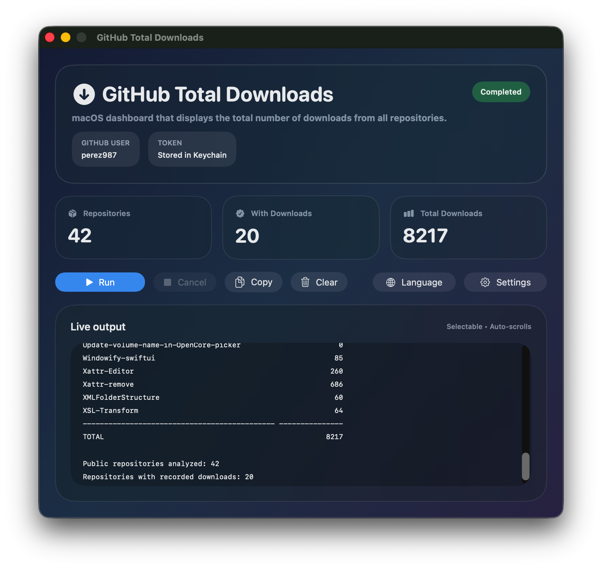
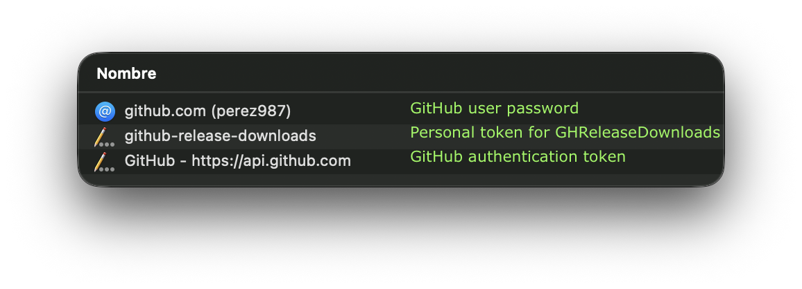

# Total downloads from all GitHub repositories


<!--  -->

GHTotalDownloads is a native macOS app that counts release downloads from all public repositories in a GitHub account. This is the SwiftUI evolution of a previous Bash script that performs the same task in the Terminal. This script is located in the `Bash-script` folder.

|                              |
| :--------------------------- |
|  |

### App requirements

- Swift 5
- macOS 14 or later
- Xcode 16 or later

### App features

- Modern SwiftUI window with gradient and glass-style panels
- **Run** button for the downloads scan
- **Settings** button for the saved GitHub user and token
- **Language** button for the languages selector
- Live, auto-scrolling, selectable output log
- Latest GitHub username saved locally with `UserDefaults`
- GitHub classic token stored only in the macOS Keychain under the `github-release-downloads` service
- Copy output, clear output, cancel run, and summary cards for totals.

### Open the app in Xcode

Open `GH-total-downloads/GHTotalDownloadsApp.xcodeproj` in Xcode 16 and run the `GHTotalDownloadsApp` app target.

### Configure credentials in the app

1. Open **Settings**
2. Enter the GitHub username to query
3. Paste the GitHub classic token into the secure field
4. Save the token to the Keychain.

The app uses the Keychain service name `github-release-downloads`. The app does not save the token as plain text.

> When the user clicks the text field for entering the classic token, a link to the Passwords app appears automatically because it is a SecureField; however, the classic token value is stored in the Keychain rather than in Passwords, making this link useless.

## Objective

The script iterates through all public repositories of a GitHub user, sums the `download_count` field of the assets from each release, and displays:

- One row per repository with its total number of downloads
- Repositories without releases or without assets with a value of `0`
- A final total that aggregates downloads from all repositories.

GitHub provides public repositories via `GET /users/{username}/repos`, and the releases of each repository via `GET /repos/{owner}/{repo}/releases`. Each asset of a release includes the `download_count` field.

## Authentication with a Personal Access Token Classic

A Personal Access Token (classic) is used to authenticate requests to the GitHub API. For this app, which queries public data, you can generate a classic token without scopes. This avoids the more restrictive limits of anonymous requests.

### Create the token

1. On GitHub, open **Settings**
2. Go to **Credentials**
3. Open **Personal access tokens (classic)**
4. Click **Generate new token** >> **Generate new token (classic)**
5. Assign a description, for example: `macOS release-downloads script`
6. Choose an appropriate expiration (7, 30, 60, 90 days, custom, or no expiration date)
7. For this public information use, do not select scopes
8. Click **Generate token** and copy it immediately. GitHub does not show the full value again later.

You do not need to select _scopes_ to query releases and public repositories. Avoiding unnecessary permissions reduces the impact if the token is lost.

### Keys in Keychain

For the app to work, three items must exist in the Keychain:

- the user's GitHub login password
- the personal GitHub classic token (`github-release-downloads` service)
- the authentication password for accessing GitHub from apps (`git` or `gh` in Terminal, GitHub Desktop, etc.).

Two of these—the user password and the authentication password—should already exist if you use GitHub on the web and your Mac; you would only need to add the classic token when using this app.

|                                  |
| :------------------------------- |
|  |

## What the result measures

The result sums downloads of **_assets_ explicitly attached** to releases: for example, `.dmg`, `.zip`, `.tar.gz`, and binaries published as _assets_: ZIP, DMG, etc.

It does not necessarily represent:

- Repository clones
- Repository visits or traffic
- Installations made via Homebrew, npm, pip, or other package managers
- Downloads of source files that GitHub automatically generates for a _release_, when they are not _assets_ explicitly published and counted as such.

## Example output

```text
User: perez987
Querying public repositories and release asset downloads...

REPOSITORY                                          DOWNLOADS
--------------------------------------------- ---------------
About-This-Hack                                          1808
AgendaT                                                   102
Apple-Secure-Boot-and-Vault-with-OpenCore                   0
AppleHDA-back-on-macOS-26-Tahoe                             0
Audiometry                                                 92
DMGBuildNotarize                                          336
DockProgress-test                                          54
DownloadFullInstaller                                    1776
Easy-Ethernet-Icon                                          0
Fenvi-wifi-back-on-Sonoma-Sequoia-Tahoe                     0
...
--------------------------------------------------- ---------------
TOTAL                                                   17636

Public repositories analyzed: 42
Repositories with recorded downloads: 20
```
